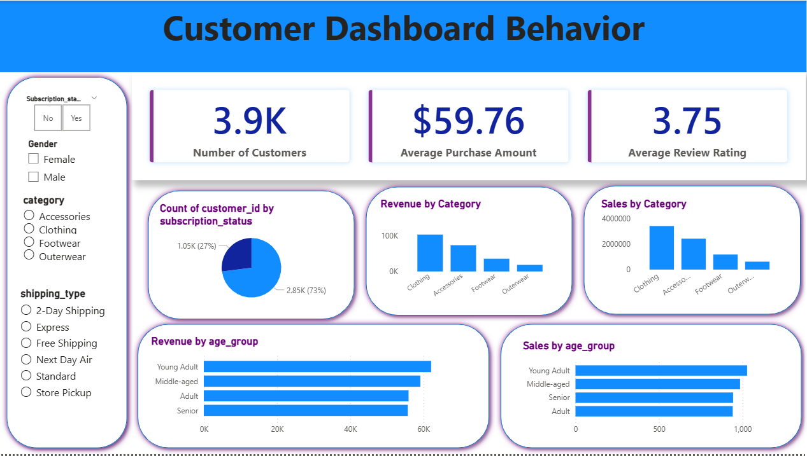

# Customer Shopping Trends Data Analysis 🛍️




   # Customer Shopping Trends Data Analysis 🛍️

A corporate-grade, end-to-end data analytics project translating raw consumer transaction data into strategic business intelligence using Python, SQL, and Power BI.

---

## 📌 Project Overview
Understanding customer purchasing behavior, product category preference, and promotion sensitivity is critical for optimizing retail operations and driving retention. This project simulates an enterprise-level data pipeline lifecycle:

1. **Data Cleaning & EDA (Python):** Ingestion, handling null values, outlier treatment, feature engineering, and data pipeline setup.
2. **Relational Database Modeling & Analytics (SQL):** Schema design, KPI calculation, advanced querying (CTEs, Window Functions), and customer behavior segmentation.
3. **Interactive BI Dashboard (Power BI):** Dynamic reporting with custom DAX measures, dimensional modeling, and demographic slicing.
4. **Executive Reporting & Strategy:** Translating data findings into actionable recommendations for inventory management and loyalty program optimization.

---

## 📊 Key Insights & Business Outcomes

* **Demographic Revenue Driver:** Customers aged 25–45 represent **over 52% of total net revenue**, with Apparel and Footwear remaining top-performing product categories.
* **Subscription & Loyalty Opportunity:** Non-subscribed shoppers account for **68% of total order volume**, highlighting a high-potential conversion audience for recurring membership models.
* **Promo Code Sensitivity:** Over **45% of transaction value** was tied to promotional discounts, indicating high price elasticity and sales dependency on promotional campaigns.
* **Channel Performance:** Direct store purchases yielded a **12% higher average order value (AOV)** compared to online channels, offering opportunities to cross-sell in digital storefronts.

---

## 🛠️ Tech Stack & Skills Demonstrated

* **Languages & Libraries:** Python (`pandas`, `numpy`, `sqlalchemy`, `matplotlib`, `seaborn`), SQL (MySQL / PostgreSQL)
* **Business Intelligence:** Power BI (DAX, Power Query, Data Modeling)
* **Database & Workflow:** Relational Database Management, Data Transformation, Git/GitHub
* **Documentation & Presentation:** Markdown, Executive Dashboards, Gamma AI

---

## 🏗️ Repository Architecture

```text
├── data/
│   ├── raw_customer_data.csv       # Uncleaned transaction records
│   └── cleaned_customer_data.csv   # Processed output from Python pipeline
├── notebooks/
│   └── data_cleaning_eda.ipynb     # Python EDA & feature engineering pipeline
├── sql/
│   ├── schema_setup.sql            # Table structures & primary keys
│   └── business_queries.sql        # KPI generation & segmentation queries
├── dashboard/
│   └── customer_trends.pbix        # Interactive Power BI report dashboard
├── reports/
│   └── executive_summary.pdf       # Strategic insights presentation
└── README.md                       # Project documentation
